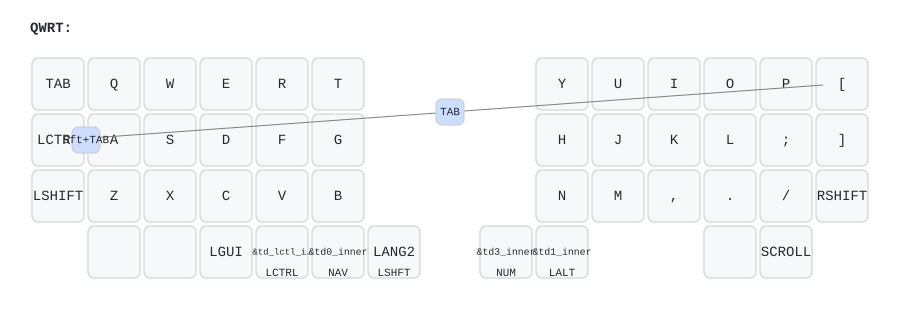
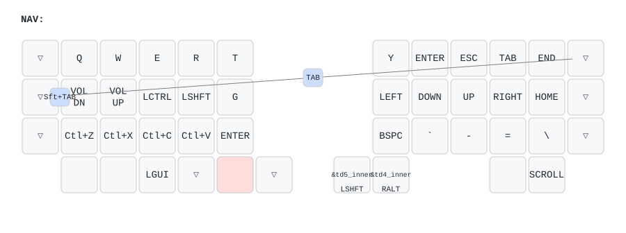
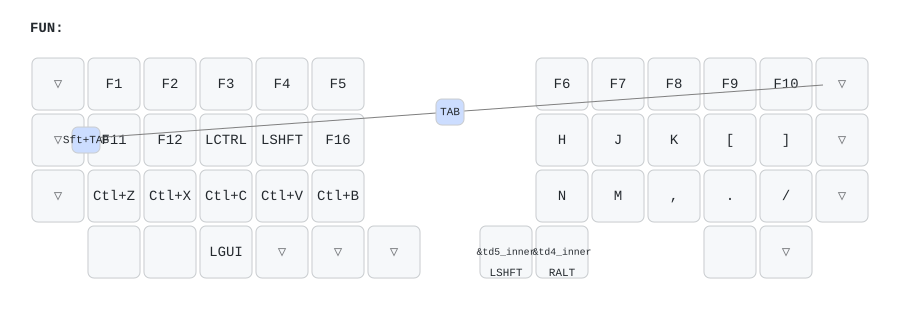
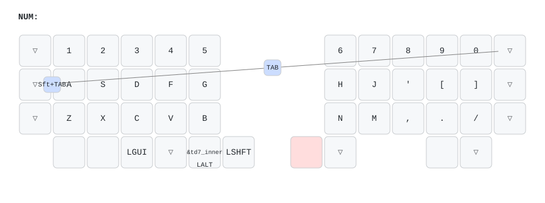
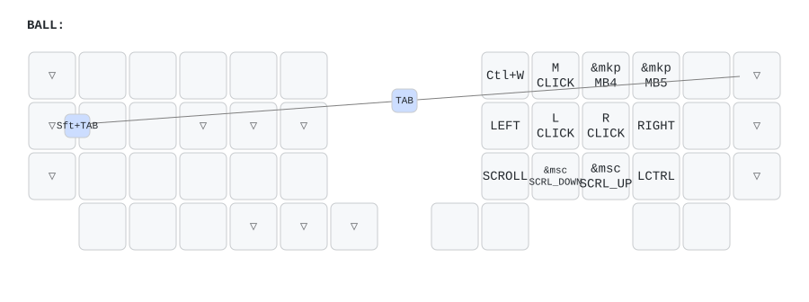
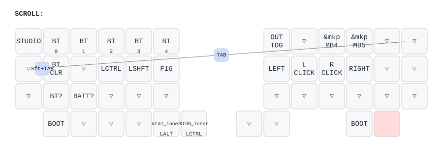

# zmk-config-CLine46-zmk41

[CLine46](https://booth.pm/ja/items/8160955)（takamaru-shop / トラックボール搭載 オーソリニア無線分割キーボード）用の個人 ZMK config。
**upstream の `zmk4.1対応` ブランチ（ZMK main+dya / Zephyr 4.1 系）をベースにしている。**

- upstream: https://github.com/takamaru-fpv/zmk_config_CLine46 （追従先ブランチは `zmk4.1対応`）
- v0.3 系ベースの別リポジトリ: https://github.com/bamebame/zmk-config-CLine46

## 構成

| | |
|---|---|
| ボード | `xiao_ble//zmk` |
| シールド | `CLine46_L` / `CLine46_R`（R が central、トラックボール搭載） |
| ZMK 本体 | `cormoran/zmk` `main+dya` @ 2026-07-25（Zephyr v4.1.0+zmk-fixes、コミット固定） |
| トラックボール | `badjeff/zmk-pmw3610-driver` `main`（`pixart,pmw3610-alt`） |
| kscan | チャーリープレクス（6本 + 割り込み1本、`wakeup-source` 有効） |
| 電池 | NiMH 単4（`zmk-feature-non-lipo-battery-management`） |

### v0.3 系（`zmk-config-CLine46`）との違い

- DYA Studio から**ランタイムマクロ / ランタイムコンボ**を編集できる
- **スクロール量と軸スナップ**を DYA Studio から調整できる（`&scroll_runtime_input_processor`。
  v0.3 系はビルド時固定の `<&zip_scroll_scaler 1 8>`）
- watchdog / kscan 診断 / device-info / fast-keymap 等の cormoran モジュールが入る
- ボード名が `seeeduino_xiao_ble` → `xiao_ble//zmk`、PMW3610 の compatible が `-alt` に変わる

### 既知のリスク

ZMK 4.1（Zephyr 4.1）系では、**`CONFIG_ZMK_STUDIO=y` のとき central が deep sleep から
復帰しない**不具合が報告されている（[zmkfirmware/zmk#3195](https://github.com/zmkfirmware/zmk/issues/3195)）。
`CLine46_R.conf` はまさに `CONFIG_ZMK_STUDIO=y` + `CONFIG_ZMK_SLEEP=y` の組み合わせ。

`CONFIG_ZMK_IDLE_SLEEP_TIMEOUT` が 2 時間なので発現しにくいが、**長時間放置後に右側
(central) が復帰しない**症状が出たらこれを疑うこと。切り分けは `CONFIG_ZMK_STUDIO=y` を
一時的に外してビルドする。

## キーマップ

**[zmk-config-Keyball44](https://github.com/bamebame/zmk-config-Keyball44) からの移植**。
上段3段は 1:1 で対応し、親指は物理 x 座標で対応付けている。Keyball44 では `&none`
だった外側の列（`TAB` `[` / `LCTRL` `]` / `LSHIFT` `RSHIFT`）は CLine46 の割当を
全レイヤーで活かしている（上位レイヤーでは `&trans`）。

Keyball44 に無い余りキーは 2 つ。左最外の親指 (p36) と右のボール右側 (p44) で、
デフォルト層では `&none`、SCROLL 層でのみ `&bootloader` を割り当てている。

緑枠は そのレイヤーを開いているキー（held）、`▽` は下の層への透過。

### QWRT — デフォルト層



### NAV — ナビ / 音量 / コピペ（左親指 `&td0 NAV`）



### FUN — F-key（`&td0` の tap から `&mo FUN`）



### NUM — 数字行（右親指 `&td3 NUM`）



### BALL — マウス層（**ボールを動かすと自動で入る**）

停止後 500ms、または `excluded-positions` 外のキー押下で抜ける。詳細は下の
「オートマウスレイヤー」を参照。



### SCROLL — 設定層（右親指最外 `&mo SCROLL`）

ボール操作がスクロールになる層でもある。`BOOT` はブートローダー（左右に 1 つずつ）、
`STUDIO` は ZMK Studio のロック解除。



### キーマップ図の再生成

`config/CLine46.keymap` を変更したら以下で作り直す。物理レイアウトは
`config/CLine46.json`（46キー分の座標）を使う。

```sh
pip install keymap-drawer

keymap -c keymap_drawer.config.yaml parse -z config/CLine46.keymap > keymap-drawer/CLine46.yaml
# parse 直後の layout 行を、このリポジトリ内のレイアウト定義に差し替える
sed -i 's|layout: {zmk_keyboard: CLine46}|layout: {qmk_info_json: config/CLine46.json}|' keymap-drawer/CLine46.yaml

keymap -c keymap_drawer.config.yaml draw -o keymap-drawer/CLine46.svg keymap-drawer/CLine46.yaml
for L in $(python -c "import yaml; print(' '.join(yaml.safe_load(open('keymap-drawer/CLine46.yaml'))['layers']))"); do
  keymap -c keymap_drawer.config.yaml draw -o "keymap-drawer/CLine46-$L.svg" keymap-drawer/CLine46.yaml -s "$L"
done
```

`keymap_drawer.config.yaml` の `raw_binding_map` は、keymap-drawer が名前を解決できない
behavior（`&bootloader` / `&studio_unlock` / `&mkp`）に読みやすいラベルを与えている。

通常はこれを手で叩く必要はない。`.github/workflows/draw.yml` が
`config/CLine46.keymap` / `config/CLine46.json` / `keymap_drawer.config.yaml` の
push を検知して同じ処理を実行し、`[Draw] ... [skip ci]` というコミットで
図を自動更新する（`[skip ci]` によりファームの再ビルドは走らない）。
描画するレイヤー名は parse 結果から取得するため、レイヤーを増減しても追従する。

## 運用モデル: キーマップの主権はこのリポジトリ

キーマップは `config/CLine46.keymap` で管理する。DYA Studio / ZMK Studio は
**設定の確認と、リポジトリ変更の取り込み**に使う。

### なぜ手順が要るか

Studio でキーマップを編集すると、その内容はデバイスの settings 領域に保存され
（`zmk_keymap_save_changes()` → `settings_save_one("keymap/...")`）、
**起動時にファーム内蔵のキーマップを上書きする**。settings は UF2 の書き込みでは
消えないため、リポジトリを直してファームを焼いても反映されない。

### 反映手順

1. `config/CLine46.keymap` を編集して push
2. GitHub Actions のビルド成果物（uf2）を左右それぞれに書き込む
3. **一度でも Studio でキーマップを編集したことがある場合のみ**、DYA Studio で
   `&studio_unlock`（SCROLL 層にある）→ 設定リセット（`core.reset_settings` RPC）を実行。
   保存済みキーマップが破棄され、ファーム内蔵＝このリポジトリの内容が有効になる

Studio を一度も使っていなければ 3 は不要。

### Studio 側に任せる設定

`CONFIG_ZMK_SETTINGS_RPC` / `CONFIG_ZMK_RUNTIME_INPUT_PROCESSOR` が有効なため、
**スリープ時間・トラックボールの CPI・スクロール量などは DYA Studio から実行時に変更できる**。
`.conf` や overlay の値は初期値でしかない。これらは再ビルドせず Studio で調整する。

## 独自の変更点（upstream からの差分）

### オートマウスレイヤーの有効化と誤爆対策

`boards/shields/CLine46/CLine46_R.overlay`

upstream ではコメントアウトされている `zip_temp_layer` を有効化し、誤爆対策を追加した。

```
ボールを動かす → BALL(4) 層 ON   ※直前 150ms 以内に打鍵していれば発動しない
何かキーを打つ → 即 OFF           ※excluded-positions のキーを除く
500ms 放置     → OFF
```

- `require-prior-idle-ms = <150>` … タイピング中の誤爆を防ぐ
- `excluded-positions` … BALL 層で実際に使うキー（右手クラスタ + 外側列の修飾キー + 左親指 `td_lctl`）。
  ここに無いキーを押すと即座に層が抜ける
- タイムアウト … `<&zip_temp_layer 4 500>` の `500`

`zip_temp_layer` には移動量のしきい値が無いので、誤爆は移動量ではなく
「打鍵からの経過時間」と「打鍵による即時解除」で抑えている。

**注意**: `zip_temp_layer 4 500` の `4`（BALL 層のインデックス）はコンパイル時に固定される。
Studio でレイヤー構成を組み替えるとここは追従しないので、レイヤー順を変えたら overlay も直すこと。

BALL 層の左手はほぼ `&none` / `&trans`。`excluded-positions` に無いキーは押した時点で
層を抜けるので、誤爆しても次の打鍵から通常どおり入力できる。

## ファームウェアの書き込み

DYA Studio / ZMK Studio に uf2 書き込み機能は無い（Studio が扱うのは実行中ファームの設定だけ）。
書き込みは UF2 ブートローダーへのファイルコピーで行う。

### ブートローダーへの入り方

- **キーで入る（推奨）**: `&mo SCROLL`（右親指の最も外側）を押しながら、
  **左半体は最も外側の左親指キー / 右半体はボール右側の内側キー**（SCROLL 層の図で `BOOT` と表示されている 2 箇所）。
  `&bootloader` は `BEHAVIOR_LOCALITY_EVENT_SOURCE` なので **押した側の半体だけ**が入る。
- **物理リセット**: ケースの ▢ の穴から竹串などで Xiao の reset スイッチを 2 回クリック。
  `&bootloader` を含まないファームが入っている場合（初回など）はこちら。

### 手順

```sh
# Actions から uf2 を取得
gh run download <run-id> -n firmware -D /tmp/cline46-fw

# 書き込みたい側を USB 接続 → 上記いずれかでブートローダーへ
lsblk -o NAME,LABEL,SIZE,MOUNTPOINT | grep -i xiao
udisksctl mount -b /dev/sdX1          # 自動マウントされなければ

cp /tmp/cline46-fw/CLine46_R.uf2 /run/media/$USER/<VOLUME>/
sync
```

コピー完了と同時に自動で再起動する。**左右それぞれ**に対して繰り返すこと。

## upstream への追従

追従先は `main` ではなく `zmk4.1対応` ブランチ。

```sh
git fetch upstream
git merge upstream/zmk4.1対応
```

## ビルド

push すると GitHub Actions が `CLine46_L` / `CLine46_R` / `settings_reset` の uf2 を生成する。

v0.3 系ファームから乗り換える場合は、settings のフォーマットが変わるため
**先に `settings_reset.uf2` を当てる**のが安全。
